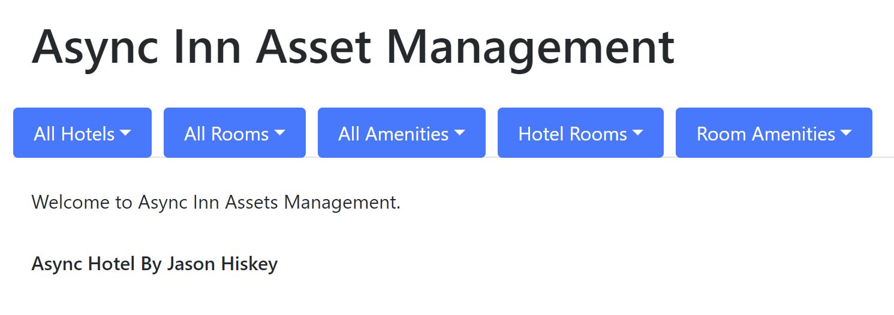
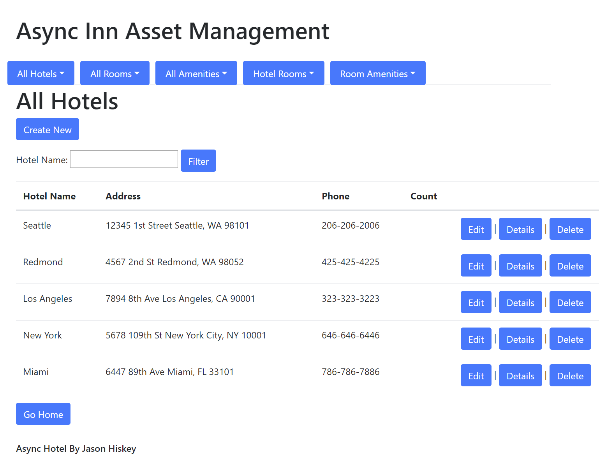
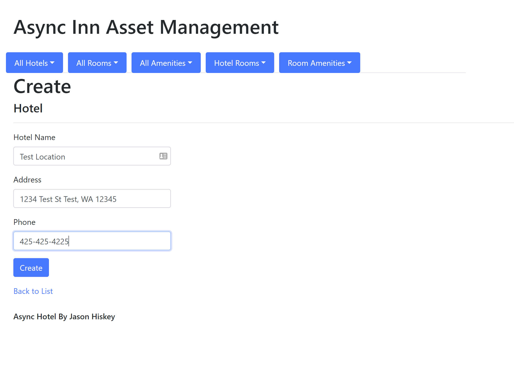
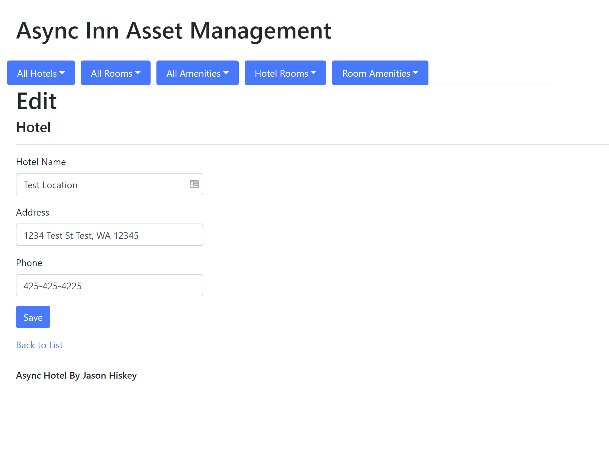
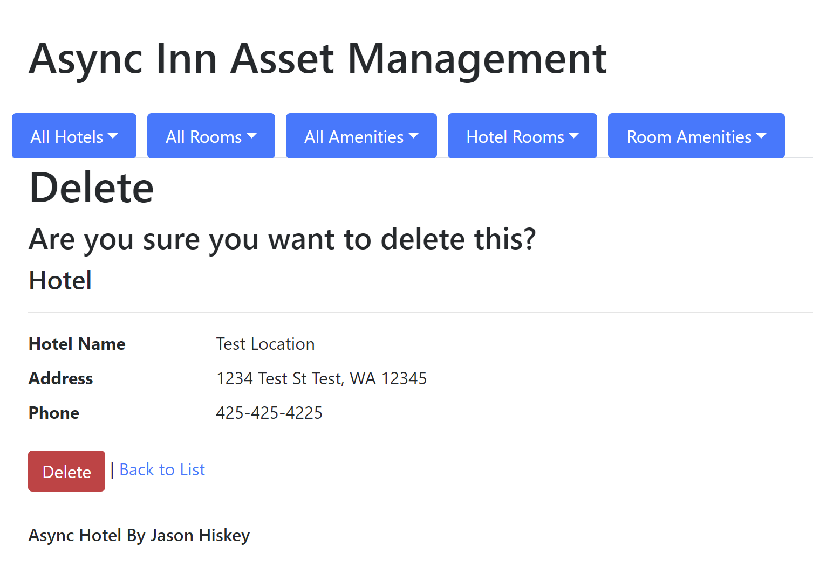

# Lab 13-14: Async Inn Managment System

- This Application is a hypothetical hotel asset management system using Entity Framework in an MVC application.
   
## Resources
- MVC Setup https://github.com/codefellows/seattle-dotnet-401d6/blob/master/Class13/MVCSetup.md

## Example Usage
### On Page Load

    

### All Hotels

#### Index

#### Create New

- After Create Button is selected.

#### Edit

#### Delete

### Schema Used

- Used Code Fellows design.

### Tables:

#### Primary Tables
##### Hotel
- **Hotel** table is a collection of all Hotels. A **Hotel** can have multiple **Room**'s which are joined through the **HotelRoom** table.

##### Room
- **Room** table is a collection of all Room types. A **Room** can have multiple **Amenities**'s which are joined through the **RoomAmenities** table.

##### Amenities
- **Amenities** table is a collection of all Amenities types. **Amenities** can be in multiple **Room**'s which are joined through the **RoomAmenities** table.

#### Join Tables

##### HotelRoom
- **HotelRoom** table is a collection of all **Room**'s in a single **Hotel**. A **HotelRoom** table is an entity join table of **Room** and **Hotel** using **HotelID** and **RoomNumber** as a Composite Key. This table also provides a payload of **Price** and **PetFriendly**.

##### RoomAmenities
- **RoomAmenities** table is a collection of all **Amenities** in a single **Room**. A **RoomAmenities** table is an entity join table of **Room** and **Amenities** using **RoomID** and **AmenitiesID** as a Composite Key.

